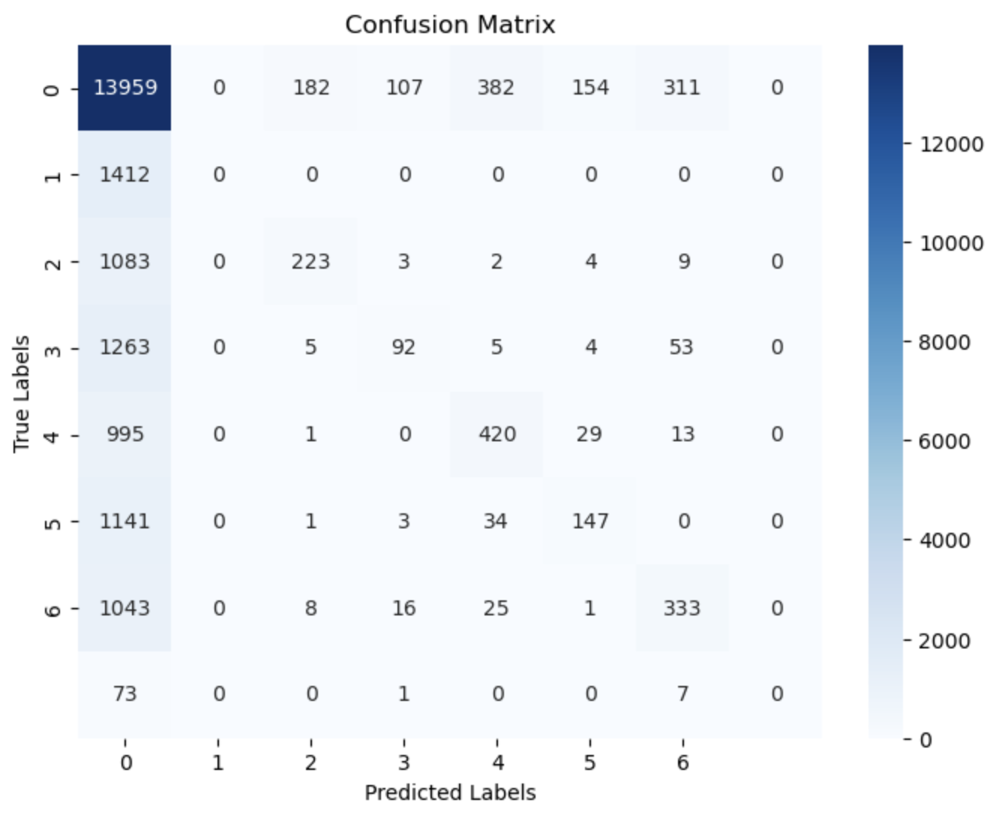

# EMG Gesture Classification with CNN

## Overview
This project is a deep learning-based approach to classify static hand gestures using surface Electromyographic (EMG) data. The gestures are detected based on data collected from a MYO Thalmic bracelet, which records EMG signals from eight sensors placed around the user's forearm. The model utilizes a Convolutional Neural Network (CNN) for efficient feature extraction and classification.

## Dataset
The dataset used for training and evaluation is the **EMG Data for Gestures** dataset from the UCI Machine Learning Repository.
- **Source**: [UCI EMG Data for Gestures Dataset](https://archive.ics.uci.edu/dataset/481/emg+data+for+gestures)
- **Description**:
  - Contains raw EMG data collected from 36 subjects.
  - Each subject performed a series of six to seven basic static hand gestures, with each gesture lasting 3 seconds followed by a 3-second pause.
  - Data includes 8 EMG channels and gesture labels.
  - Gesture classes:
    - 0: Unmarked data
    - 1: Hand at rest
    - 2: Hand clenched in a fist
    - 3: Wrist flexion
    - 4: Wrist extension
    - 5: Radial deviations
    - 6: Ulnar deviations
    - 7: Extended palm (the gesture was not performed by all subjects).


## Project Workflow

### 1. **Data Preprocessing**
The raw EMG data is preprocessed for training and evaluation:
- **File Traversal**: The raw `.txt` files are loaded and combined into a single dataset.
- **Filtering**: Invalid rows and files with incorrect formats are ignored.
- **Normalization**: The EMG signal values are normalized to the range [0, 1].
- **Segmentation**: The data is segmented into fixed-size windows (36 time steps).
- **Preprocessed Data Storage**: The processed data is saved as a `.pt` file using PyTorch.

### 2. **Model Architecture**
The project uses a CNN designed for 1D EMG signal data:
- **Convolutional Layers**:
  - Two 1D convolutional layers to extract spatial features from the 8 EMG channels.
  - Kernel size: 3
  - Padding: 1
  - Output channels: 16 and 32
- **Fully Connected Layers**:
  - One fully connected layer with 128 neurons.
  - Final layer with 7 neurons corresponding to the 7 gesture classes.
- **Activation Function**: ReLU (Rectified Linear Unit)
- **Loss Function**: CrossEntropyLoss
- **Optimizer**: Adam optimizer with a learning rate of 0.001.

### 3. **Model Training**
- **Epochs**: 10
- **Batch Size**: 16
- **Training Data**: 80% of the preprocessed data
- **Validation Data**: 20% of the preprocessed data
- The training loop calculates the loss and updates the model weights using backpropagation.

### 4. **Evaluation**
The trained model is evaluated on the validation dataset using:
- **Accuracy**: Percentage of correctly predicted gestures.
- **Confusion Matrix**: Visual representation of model performance across all gesture classes.
- **Classification Report**: Precision, recall, and F1-score for each class.

### 5. **Model Deployment**
- The trained model weights are saved to a `.pth` file (`emg_cnn_model.pth`).
- The model can be loaded for inference to classify new EMG signals.

## Results
- **Training Loss**: Reduced consistently over the epochs.
- **Validation Accuracy**: Achieved approximately 64.86% accuracy.
- **Confusion Matrix Insights**:

  - The model performs well on certain classes (e.g., `Class 0` for unmarked data).
  - Misclassifications are observed between classes with similar EMG patterns.
- **Classification Report**:


The classification report evaluates the model's performance on each gesture class using metrics such as **Precision**, **Recall**, and **F1-Score**.

| **Metric**         | **Definition**                                                                                       |
|---------------------|---------------------------------------------------------------------------------------------------|
| **Precision**      | Correct predictions out of total predictions for a class.                                         |
| **Recall**         | Correct predictions out of total samples for a class.                                    |
| **F1-Score**       | The mean of precision and recall. Balances both metrics.                                     |
| **Support**        | Total samples for each class in the dataset.                                               |

### **Key Observations**
- **Class 0** (Unmarked data) performs best, with an F1-score of 0.78, precision of 0.68, and recall of 0.91.
- **Class 1** (Hand at rest) shows poor performance (\(0.00\) for all metrics), likely due to class imbalance.
- Other gesture classes (2–6) achieve moderate F1-scores (0.20–0.44), highlighting room for improvement.

### **Overall Performance**
- **Accuracy**: **66%** of predictions are correct.
- **Macro Average**: 
  - F1-score: **0.34** (treats all classes equally; indicates uneven performance).
- **Weighted Average**:
  - F1-score: **0.60** (accounts for class frequency; highlights dominance of Class 0).


## How to Run the Project

### Step 1: Clone the Repository
```bash
git clone https://github.com/michael8758/TNT_CNN.git
cd TNT_CNN
```

### Step 2: Install Dependencies
Create a virtual environment and install the required libraries:
```bash
python -m venv venv
source venv/bin/activate
pip install -r requirements.txt
```

### Step 3: Preprocess the Data
Run the preprocessing script to generate `preprocessed_data.pt`:
```bash
python Scripts/preprocess.py
```

### Step 4: Train the Model
Train the CNN model using the training script:
```bash
python Scripts/CNN_model.py
```

### Step 5: Evaluate the Model
Evaluate the trained model and visualize results in the Jupyter notebook:
```bash
jupyter notebook Notebook/evaluation.ipynb
```

## Acknowledgments
- The UCI Machine Learning Repository for providing the dataset.
- The developers of PyTorch and other open-source libraries used in this project.

